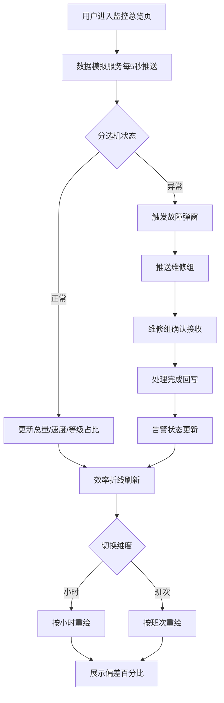

# 水果分选包装车间监控面板 - 产品需求文档（PRD）

## 1. 产品概述

本项目是一款面向水果分选包装车间的实时数据监控面板，采用 Vue3 + ECharts + Element Plus 技术栈构建。主要服务于车间管理人员、生产调度员和设备维护人员，通过对分选线、等级产出、包装区、故障告警和产线效率的集中可视化，实现车间生产全流程的透明化管理与异常快速响应。

- **核心目标**：将分散的车间运行数据汇聚为一块"指挥大屏"，让管理者在一屏之内掌握处理量、等级分布、包装进度、设备健康与效率偏差。
- **目标用户**：车间主任、生产调度员、维修班组、品质工程师。
- **市场价值**：降低异常响应时间（目标 < 500ms 更新、秒级告警推送），提升产线 OEE 与一次合格率。

## 2. 核心功能

### 2.1 用户角色

| 角色 | 接入方式 | 核心权限 |
|------|---------------------|------------------|
| 车间主任 | 账号登录 | 全局监控、效率分析、模式切换 |
| 生产调度员 | 账号登录 | 实时数据查看、包装规格切换、工人调整 |
| 维修班组 | 账号登录 | 接收告警、确认接收、标记处理完成 |

### 2.2 功能模块

1. **监控总览页**：三栏式车间指挥大屏，集成全部分选、包装、告警与效率模块。
2. **告警中心**：右侧告警信息流 + 自动弹窗，含推送与状态回执。

### 2.3 页面详情

| 页面名称 | 模块名称 | 功能描述 |
|-----------|-------------|---------------------|
| 监控总览页 | 分选线实时数据监控 | 今日处理总量（吨，2 位小数）、分选速度（吨/小时，5 秒更新）、运行状态指示灯（运行中/停机/故障） |
| 监控总览页 | 等级产出比例分析 | 环形图展示特级/一级/二级/次果占比，数字仪表盘显示各等级累计重量（吨） |
| 监控总览页 | 包装区监控 | 当前包装品种（文字+图片）、规格选择（5kg/10kg/礼盒，高亮选中）、包装完成件数（每 10 件动画）、在线工人数（手动更新） |
| 监控总览页 | 故障告警系统 | 异常自动弹窗（传感器失灵/重量偏差超限/光电识别错误），含类型/时间/位置/紧急程度，推送维修组并反馈接收与处理完成 |
| 监控总览页 | 当日产线效率分析 | 折线图对比实际产出与计划产出，偏差百分比（正绿负红），按小时/班次切换 |
| 监控总览页 | 主题切换 | 深色/浅色模式切换 |
| 告警中心 | 告警信息流 | 右侧实时告警列表与处理状态回显 |

## 3. 核心流程

**主流程**：用户登录后进入监控总览页 → 左侧导航定位模块 → 中间主区展示实时数据卡片与图表 → 右侧告警流滚动 → 触发故障时自动弹窗 → 推送维修组 → 接收确认 → 处理完成回写状态 → 效率分析按维度刷新。

## 4. 界面设计

### 4.1 设计风格

- **主色调**：深蓝色系（#0B1F3A / #11294B 卡片底色），辅以功能色：正常绿色 #2BD4A4、异常红色 #FF4D5E、警示橙 #FFA940、信息蓝 #2F7BFF。
- **按钮风格**：圆角 8px、卡片化、微投影；规格选中态使用高亮描边 + 渐变填充。
- **字体**：标题使用强对比大字体（数字仪表盘 36–48px），正文使用 12–14px，等宽数字保证对齐。
- **布局**：三栏式——左侧导航（窄）、中间主监控区（宽，卡片式网格）、右侧告警信息流（窄）。
- **图标/emoji**：使用 lucide 图标 + Element Plus 内置图标，水果品种使用真实图片占位。

### 4.2 页面设计总览

| 页面名称 | 模块名称 | UI 元素 |
|-----------|-------------|-------------|
| 监控总览页 | 顶部状态栏 | 车间标题、当前班次、时间、深色/浅色切换、在线人数 |
| 监控总览页 | 分选线监控卡片 | 大数字总量、速度趋势、状态指示灯（脉冲动画） |
| 监控总览页 | 等级环形图 | 4 段环形 + 中心总量、图例可点击交互 |
| 监控总览页 | 等级仪表盘 | 4 个数字仪表盘横向排列，带进度环 |
| 监控总览页 | 包装区卡片 | 品种图、规格三选高亮、件数动画、工人增减按钮 |
| 监控总览页 | 效率折线图 | 双折线 + 偏差色块 + 维度切换 Tabs |
| 监控总览页 | 右侧告警流 | 时间线样式、紧急程度色标、状态标签 |
| 告警中心 | 故障弹窗 | 类型图标、时间、位置、紧急徽章、推送/确认/完成按钮 |

### 4.3 响应式

- **桌面优先**：面向车间大屏（1920×1080 起），三栏布局在 ≥1200px 全展示。
- **中等屏适配**：在 768–1200px 收起右侧告警为抽屉式。
- **触摸优化**：关键操作按钮 ≥44px，图表支持 tooltip 与图例点击。

### 4.4 3D 场景

本项目暂不涉及 3D 场景。
