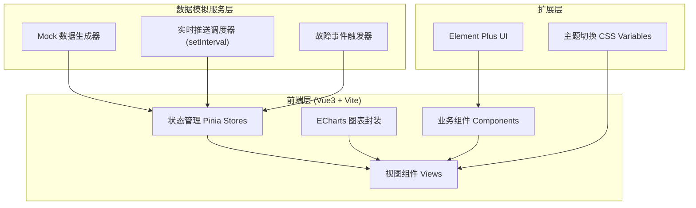
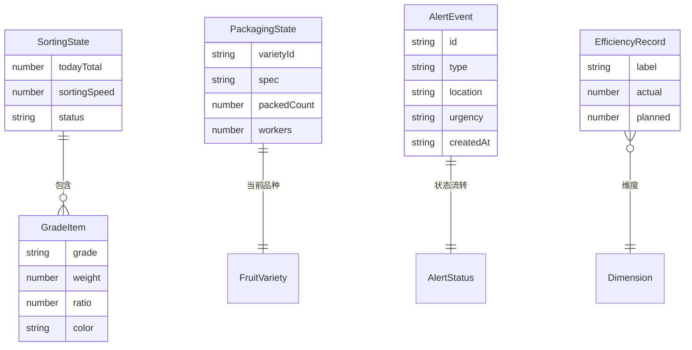

# 水果分选包装车间监控面板 - 技术架构文档

## 1. 架构设计



## 2. 技术说明

- **前端框架**：Vue 3 + TypeScript + Vite（使用 vite-init 的 vue-ts 模板）
- **UI 组件库**：Element Plus（按需引入 + 暗色主题）
- **图表库**：ECharts 5（封装通用 useECharts 组合式函数）
- **状态管理**：Pinia（sorting / packaging / alert / efficiency 四个 store）
- **样式方案**：Tailwind CSS + CSS Variables 实现深/浅色主题切换
- **图标库**：lucide 图标（通过 @element-plus/icons-vue 与 lucide）
- **初始化工具**：vite-init（vue-ts 模板）
- **后端**：无后端，全部使用 Mock 数据模拟服务
- **数据来源**：前端 Mock 服务，通过 setInterval 模拟 5 秒/秒级数据推送

## 3. 路由定义

| 路由 | 用途 |
|-------|---------|
| / | 监控总览页（三栏车间指挥大屏） |

## 4. API 定义

本项目无真实后端 API，使用前端 Mock 数据服务。关键数据接口（内部函数）：

- `getSortingRealtime()`：返回今日总量、分选速度、运行状态
- `getGradeDistribution()`：返回特级/一级/二级/次果重量与占比
- `getPackagingStatus()`：返回当前品种、规格、完成件数、工人数
- `triggerFault()`：随机生成故障事件
- `getEfficiencyData(dimension)`：按小时/班次返回实际与计划产出

## 5. 服务端架构

无后端，略。

## 6. 数据模型

### 6.1 数据模型定义



### 6.2 数据定义语言

本项目不涉及数据库，以下为 Pinia Store 的 TypeScript 类型定义：

```ts
// 分选状态
interface SortingState {
  todayTotal: number        // 今日处理总量（吨）
  sortingSpeed: number      // 分选速度（吨/小时）
  status: 'running' | 'stopped' | 'fault'  // 运行状态
}

// 等级项
interface GradeItem {
  grade: 'premium' | 'first' | 'second' | 'sub'  // 等级
  weight: number    // 累计重量（吨）
  ratio: number     // 占比
  color: string     // 颜色
}

// 包装状态
interface PackagingState {
  varietyId: string
  varietyName: string
  spec: '5kg' | '10kg' | 'gift'  // 规格
  packedCount: number           // 完成件数
  workers: number               // 在线工人数
}

// 告警事件
interface AlertEvent {
  id: string
  type: 'sensor' | 'weight' | 'optical'  // 故障类型
  location: string
  urgency: 'high' | 'medium' | 'low'
  createdAt: string
  status: 'pending' | 'received' | 'resolved'
  receiver?: string
}

// 效率记录
interface EfficiencyRecord {
  label: string
  actual: number
  planned: number
  deviation: number  // 偏差百分比
}
```
